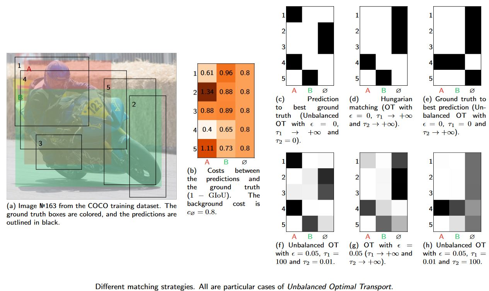

# Unbalanced Optimal Transport: A Unified Framework for Object Detection
Henri De Plaen, Pierre-François De Plaen, Johan A. K. Suykens, Marc Proesmans, Tinne Tuytelaars, and Luc Van Gool. 2023. “Unbalanced Optimal Transport: A Unified Framework for Object Detection.” In *Proceedings of the IEEE/CVF Conference on Computer Vision and Pattern Recognition (CVPR)*.

Presented at CVPR 2023. The paper and additional resources can be found on the [following website](https://hdeplaen.github.io/uotod/).



## Abstract
*TL;DR: We introduce a much more versatile new class of matching strategies unifying many existing ones, as well as being well suited for GPUs.*

During training, supervised object detection tries to correctly match the predicted bounding boxes and associated classification scores to the ground truth. This is essential to determine which predictions are to be pushed towards which solutions, or to be discarded. Popular matching strategies include matching to the closest ground truth box (mostly used in combination with anchors), or matching via the Hungarian algorithm (mostly used in anchor-free methods). Each of these strategies comes with its own properties, underlying losses, and heuristics. We show how Unbalanced Optimal Transport unifies these different approaches and opens a whole continuum of methods in between. This allows for a finer selection of the desired properties. Experimentally, we show that training an object detection model with Unbalanced Optimal Transport is able to reach the state-of-the-art both in terms of Average Precision and Average Recall as well as to provide a faster initial convergence. The approach is well suited for GPU implementation, which proves to be an advantage for large-scale models.

## BibTex
```bibtex
@InProceedings{DePlaen_2023_CVPR,
    author    = {De Plaen, Henri and De Plaen, Pierre-François and Suykens, Johan A. K. and Proesmans, Marc and Tuytelaars, Tinne and Van Gool, Luc},
    title     = {Unbalanced Optimal Transport: A Unified Framework for Object Detection},
    booktitle = {Proceedings of the IEEE/CVF Conference on Computer Vision and Pattern Recognition (CVPR)},
    month     = {June},
    year      = {2023},
    pages     = {}
}
```

## Acknowledgements
During training, supervised object detection tries to correctly match the predicted bounding boxes and associated classification scores to the ground truth. This is essential to determine which predictions are to be pushed towards which solutions, or to be discarded. Popular matching strategies include matching to the closest ground truth box (mostly used in combination with anchors), or matching via the Hungarian algorithm (mostly used in anchor-free methods). Each of these strategies comes with its own properties, underlying losses, and heuristics. We show how Unbalanced Optimal Transport unifies these different approaches and opens a whole continuum of methods in between. This allows for a finer selection of the desired properties. Experimentally, we show that training an object detection model with Unbalanced Optimal Transport is able to reach the state-of-the-art both in terms of Average Precision and Average Recall as well as to provide a faster initial convergence. The approach is well suited for GPU implementation, which proves to be an advantage for large-scale models.
<p style="text-align: center;">


</p>