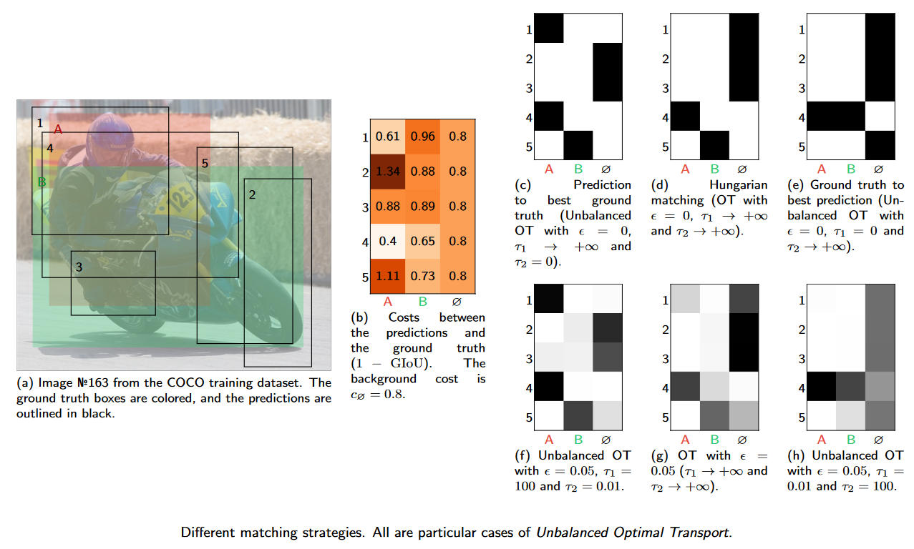
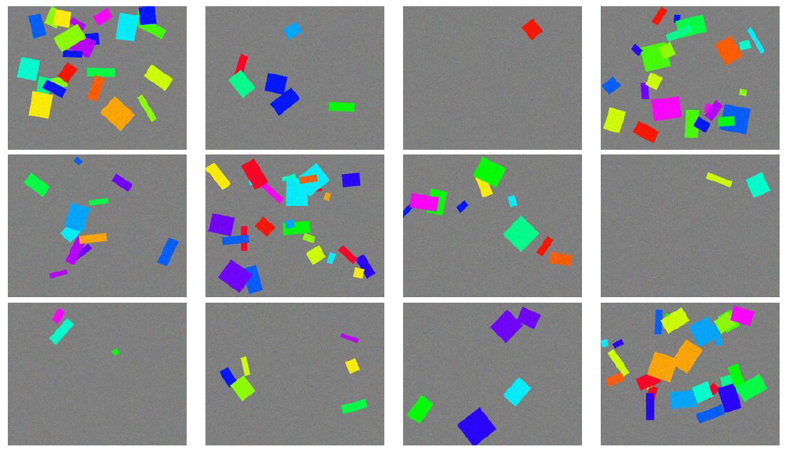

# Unbalanced Optimal Transport: A Unified Framework for Object Detection
<a href="https://hdeplaen.github.io/uotod/" target="_blank">Website</a>&nbsp;&nbsp;&nbsp;&nbsp;&nbsp;&nbsp;
<a href="https://openaccess.thecvf.com/content/CVPR2023/papers/De_Plaen_Unbalanced_Optimal_Transport_A_Unified_Framework_for_Object_Detection_CVPR_2023_paper.pdf" target="_blank">Paper</a>&nbsp;&nbsp;&nbsp;&nbsp;&nbsp;&nbsp;
<a href="https://openaccess.thecvf.com/content/CVPR2023/supplemental/De_Plaen_Unbalanced_Optimal_Transport_CVPR_2023_supplemental.pdf" target="_blank">Supplementary</a>&nbsp;&nbsp;&nbsp;&nbsp;&nbsp;&nbsp;
<a href="https://uotod.readthedocs.io/en/latest/" target="_blank">Documentation</a>&nbsp;&nbsp;&nbsp;&nbsp;&nbsp;&nbsp;


[](https://uotod.readthedocs.io/en/latest/?badge=latest)


[//]: # (![GitHub all releases]&#40;https://img.shields.io/github/downloads/hdeplaen/uotod/total&#41;)

H. De Plaen, P.-F. De Plaen, J. A. K. Suykens, M. Proesmans, T. Tuytelaars, and L. Van Gool, “Unbalanced Optimal Transport: A Unified Framework for Object Detection,” in *Proceedings of the IEEE/CVF Conference on Computer Vision and Pattern Recognition (CVPR)*, Jun. 2023, pp. 3198–3207.

This work has be presented at CVPR 2023 in Vancouver, Canada. The paper and additional resources can be found on the [following website](https://hdeplaen.github.io/uotod/). The paper is in open access and can also be found on the [CVF website](https://openaccess.thecvf.com/content/CVPR2023/html/De_Plaen_Unbalanced_Optimal_Transport_A_Unified_Framework_for_Object_Detection_CVPR_2023_paper.html) and shortly on IEEE Xplore.



## Abstract
*TL;DR: We introduce a much more versatile new class of matching strategies unifying many existing ones, as well as being well suited for GPUs.*

During training, supervised object detection tries to correctly match the predicted bounding boxes and associated classification scores to the ground truth. This is essential to determine which predictions are to be pushed towards which solutions, or to be discarded. Popular matching strategies include matching to the closest ground truth box (mostly used in combination with anchors), or matching via the Hungarian algorithm (mostly used in anchor-free methods). Each of these strategies comes with its own properties, underlying losses, and heuristics. We show how Unbalanced Optimal Transport unifies these different approaches and opens a whole continuum of methods in between. This allows for a finer selection of the desired properties. Experimentally, we show that training an object detection model with Unbalanced Optimal Transport is able to reach the state-of-the-art both in terms of Average Precision and Average Recall as well as to provide a faster initial convergence. The approach is well suited for GPU implementation, which proves to be an advantage for large-scale models.

## Install
### PyPI

Using PyPI, it suffices to run :code:`pip install uotod`. Just rerun this command to update the package to its newest version.


### Build From Source

You can also download it directly from the GitHub repository, then build and install it.

```bash
git clone --recursive https://github.com/hdeplaen/uotod
cd uotod
python3 -m pip install -r requirements.txt
python3 -m setup build
python3 -m pip install
 ```


## Examples

### OT matching with GIoU loss:

```python
from uotod.match import BalancedSinkhorn
from uotod.loss import GIoULoss

ot = BalancedSinkhorn(
    loc_match_module=GIoULoss(reduction="none"),
    background_cost=0.,
)
```

### Hungarian matching (bipartite) with GIoU loss:

```python
from uotod.match import Hungarian
from uotod.loss import GIoULoss

hungarian = Hungarian(
    loc_match_module=GIoULoss(reduction="none"),
    background_cost=0.,
)
```

### Loss from SSD solved with Unbalanced Optimal Transport:

```python
from torch.nn import L1Loss, CrossEntropyLoss

from uotod.match import UnbalancedSinkhorn
from uotod.loss import DetectionLoss, IoULoss

matching_method = UnbalancedSinkhorn(
    cls_match_module=None,  # No classification cost
    loc_match_module=IoULoss(reduction="none"),
    background_cost=0.5,  # Threshold for matching to background
    is_anchor_based=True,  # Use anchor-based matching
    reg_target=1e-3,  # Relax the constraint that each ground truth is matched to exactly one prediction
)

loss = DetectionLoss(
    matching_method=matching_method,
    cls_loss_module=CrossEntropyLoss(reduction="none"),
    loc_loss_module=L1Loss(reduction="none"),
)

preds = ...
targets = ...
anchors = ...

loss_value = loss(preds, targets, anchors)
```

### Loss from DETR solved with Optimal Transport (num_classes=3):

```python
import torch
from torch.nn import L1Loss, CrossEntropyLoss

from uotod.match import BalancedSinkhorn
from uotod.loss import DetectionLoss
from uotod.loss import MultipleObjectiveLoss, GIoULoss, NegativeProbLoss

matching_method = BalancedSinkhorn(
    cls_match_module=NegativeProbLoss(reduction="none"),
    loc_match_module=MultipleObjectiveLoss(
        losses=[GIoULoss(reduction="none"), L1Loss(reduction="none")],
        weights=[1., 5.],
    ),
    background_cost=0.,  # Does not influence the matching when using balanced OT
)

loss = DetectionLoss(
    matching_method=matching_method,
    cls_loss_module=CrossEntropyLoss(
        reduction="none",
        weight=torch.tensor([0.1, 1., 1.])  # down-weight the loss for the no-object class
    ),
    loc_loss_module=MultipleObjectiveLoss(
        losses=[GIoULoss(reduction="none"), L1Loss(reduction="none")],
        weights=[1., 5.],
    ),
)

preds = ...
targets = ...
loss_value = loss(preds, targets)
```


## Color Boxes Dataset


## BibTex
If you make any use of our work, please refer to us as:
```bibtex
@InProceedings{De_Plaen_2023_CVPR,
    author    = {De Plaen, Henri and De Plaen, Pierre-Fran\c{c}ois and Suykens, Johan A. K. and Proesmans, Marc and Tuytelaars, Tinne and Van Gool, Luc},
    title     = {Unbalanced Optimal Transport: A Unified Framework for Object Detection},
    booktitle = {Proceedings of the IEEE/CVF Conference on Computer Vision and Pattern Recognition (CVPR)},
    month     = {June},
    year      = {2023},
    pages     = {3198-3207}
}
```

## Acknowledgements
EU: The research leading to these results has received funding from the European Research Council under the European Union’s Horizon 2020 research and innovation program / ERC Advanced Grant E-DUALITY (787960). This paper reflects only the authors’ views and the Union is not liable for any use that may be made of the contained information. Research Council KUL: Optimization frameworks for deep kernel machines C14/18/068. Flemish Government: FWO: projects: GOA4917N (Deep Restricted Kernel Machines: Methods and Foundations), PhD/Postdoc grant; This research received funding from the Flemish Government (AI Research Program). All the authors are also affiliated to Leuven.AI - KU Leuven institute for AI, B-3000, Leuven, Belgium.
<p style="text-align: center;">


</p>